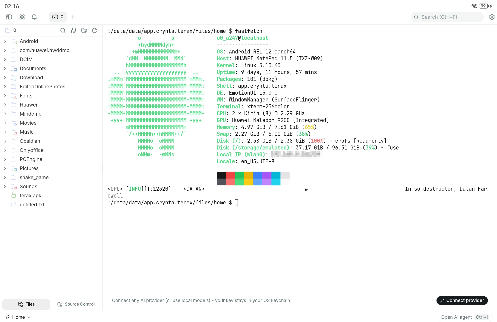
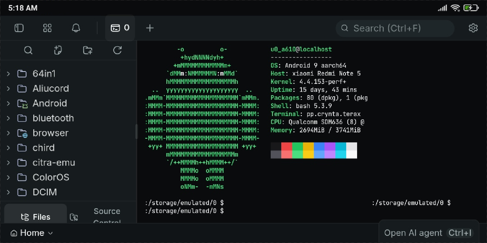

# Terax Android

<p align="center">
  
  
  
  
  <br />
  
  
  
  
</p>

> [!WARNING]
> **Beta software.** This project is in beta development. Expect bugs,
> breaking changes, and missing features/forgot feature. Option recommended for production use.

> [!CAUTION]
> Tested on Huawei MatePad 11.5" (HarmonyOS) and Redmi Note 5 Pro.
> Phone portrait mode works well. On small phones, landscape mode (known design hard).
> Other Android/HarmonyOS devices may have different SELinux policies.
> dpkg may report errors during package installation — packages still
> work, errors are non-fatal.

A terminal app for Android tablets and phones with bash and apt package manager.

> [!NOTE]
> This is a fork of [terax-ai](https://github.com/crynta/terax-ai) by [@zico20047](https://github.com/zico20047).

## Screenshots

<p align="center">
  
</p>
<p align="center">
  
</p>

<!-- Add screenshots here when ready:

### Tablet

<p align="center">
  
  
  
</p>

### Phone

<p align="center">
  
  
  
</p>

-->

## Features

- **bash terminal** with coreutils
- **apt package manager** — can you use package like termux(pkg)
- **Touch text selection** — hold and drag to select, copy, paste (wterm DOM renderer on mobile) Coming Soon (known bugs)
- **Extra keys bar** — CTRL, ALT, ESC, TAB, arrow keys, symbols Coming Soon (known bugs)
- **Wake lock** — screen stays on during long-running commands Coming Soon (known feat)
- **Touch scroll** — drag to scroll through terminal history
- **AI Chat** — OpenAI-compatible endpoints by terax AI 
- **File Explorer** — browse shared storage
- **Responsive UI** — tablet/phone uses desktop layout, only landscape phone uses mobile nav

## Quick Start

```bash
apt update
apt install python
python --version
```

See [Terminal Guide](docs/terminal-guide.md) for full usage.

## Requirements

- Android 7.0+ (API 24) or HarmonyOS device
- optional arm64-v8a, x86_64, armeabi-v7a, or x86 CPU
- ~300MB free space

## Documentation

| Document | Description |
|----------|-------------|
| [How to Install](docs/how-to-install.md) | Prerequisites, build, install on device |
| [Terminal Guide](docs/terminal-guide.md) | apt, pkg, popular packages |
| [Architecture](docs/architecture.md) | LD_PRELOAD, path translation, bootstrap |
| [Troubleshooting](docs/Troubleshoots.md) | Common issues and solutions |
| [Technical Paper](docs/Paper.md) | Full technical details and history |

## Limitations

- **Beta** — expect bugs and breaking changes
- **GPG warning** — apt shows `NO_PUBKEY` — cosmetic, packages install fine
- **wterm on Android** — DOM renderer has limited Android support. Native touch
  selection works but scrollback scrolling is limited. A proper fix requires a
  terminal renderer designed for Android (like Termux's own implementation).
- **Landscape on phones** — may show tablet/desktop layout instead of
  mobile UI (known bug, works fine in portrait)

## Credits

- [Termux](https://termux.dev) — bootstrap binaries and package repository
- [terax-ai](https://github.com/crynta/terax-ai) — AI development environment
- [Tauri](https://tauri.app) — app framework
- [xterm.js](https://xtermjs.org) — terminal emulator (mobile/desktop)
- [wterm](https://wterm.dev/) - limitations android terminal(testing)

## License

Apache License 2.0 — see [LICENSE](LICENSE)

The Termux bootstrap is licensed under GPLv3 — see [Termux licenses](https://github.com/termux/termux-app/blob/master/LICENSE.md)
